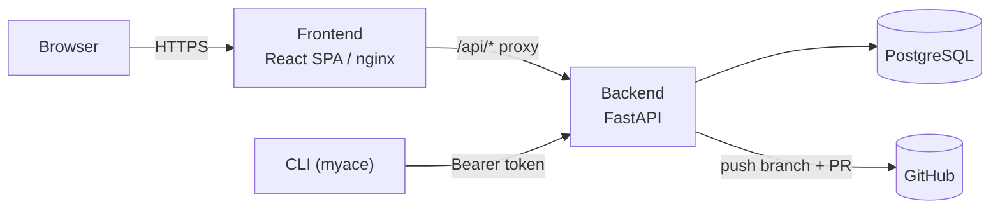

# MyACE — My Agentic Coding Environment

[](https://github.com/niels-emmer/myace/actions/workflows/ci.yml)
[](LICENSE)
[](backend/pyproject.toml)
[](frontend/package.json)

**MyACE makes your AI coding agent's rules, skills, and workflows portable.**
Write them once, keep them in one place, and compile them into whatever
format Claude Code, OpenCode, Cursor (and whatever comes next) actually
expects — instead of hand-maintaining N slightly-different copies, or
picking one tool and losing the rest.

<!--
  Screenshot placeholder — add a screenshot of the Dashboard or a Collection
  detail view here, e.g.:
  
-->

## Why this exists

If you've built up a set of coding conventions, review rubrics, or agent
personas you like, you've probably hit this: every framework wants them in
a different shape. OpenCode wants JSON skill files and an `AGENTS.md`.
Claude Code wants `CLAUDE.md` plus `.claude/agents/*.md`. Cursor wants
`.cursorrules` and `.mdc` files. None of that structure is really about the
*content* — it's packaging.

MyACE stores the content once, as Markdown with YAML frontmatter (the
**Canonical IR**), and translates it into each framework's native layout on
demand — from a web UI, or with a one-line CLI pull.

## Features

- **Import from anywhere** — scan a local config directory (`~/.claude`,
  `~/.config/opencode`, `~/.cursor`) or a GitHub repo, pick exactly which
  rules/skills/agents to bring in, and they become a portable **Collection**.
- **Compose, don't copy** — a **Profile** combines a base collection with
  additional ones, layered by priority, with individual items toggled on or
  off — a named recipe you compile per target, not a duplicated file tree.
- **Compile to any supported framework** — one click (or `myace pull`) turns
  a profile into the exact files Claude Code, OpenCode, or Cursor expect.
- **Export back out** — push a collection to a new GitHub branch and open a
  PR, so your canonical source of truth can live in its own repo.
- **A real CLI** — `myace login`, `myace pull`, `myace import --push`. Script
  it, put it in a dotfiles repo, run it on a fresh machine.
- **Real multi-user auth** — email+password or OIDC/GitHub/Google SSO,
  private-by-default collections and profiles with an explicit public/private
  flag, and an admin role for oversight. Not a toy single-user hack.

## How it works



A FastAPI backend owns the data and does all the real work; the React
frontend and the CLI are both thin clients of the same API. See
[`docs/architecture.md`](docs/architecture.md) for the full picture,
including the compilation pipeline and the auth model.

## Quick Start

### Prerequisites

- Docker & Docker Compose
- Python 3.12+ (for the CLI)
- Node.js 20+ (for frontend development)

### Clone and run it

```bash
git clone https://github.com/niels-emmer/myace.git
cd myace

# 1. Configure environment
cp .env.example .env

# 2. Start the dev stack (hot reload, direct ports, home dir mounted for import)
docker compose -f docker-compose.yml -f docker-compose.dev.yml up -d --build

# 3. Run database migrations
docker compose exec backend alembic upgrade head

# 4. Access
#    Web UI:       http://localhost:80
#    API (direct): http://localhost:8000
#    API Docs:     http://localhost:8000/docs

# For Vite HMR during frontend development:
cd frontend && npm run dev   # starts on :5173, proxies /api to :8000
```

The first person to register an account automatically becomes an admin.

### Fork it and make it yours

MyACE is designed to be forked and self-hosted, not run as someone else's
SaaS. After forking:

1. Update `.env` — at minimum, set a real random `APP_SECRET_KEY` before
   exposing it beyond localhost (it signs session cookies; the app warns at
   startup if you forget).
2. Optionally configure OIDC/GitHub/Google SSO — see
   [`.env.example`](.env.example) and
   [`docs/extending.md#adding-an-sso-provider`](docs/extending.md#adding-an-sso-provider).
3. Deploy with `docker-compose.prod.yml` behind your own reverse proxy — see
   [Production deployment](#production-vps-behind-a-reverse-proxy) below.

### Production (single machine)

```bash
docker compose up -d --build
# Access at http://localhost:80
```

### Production (VPS behind a reverse proxy)

```bash
# 1. Create an external Docker network for your proxy:
docker network create my-proxy-net

# 2. Set the network name in .env:
echo "PROXY_NETWORK=my-proxy-net" >> .env

# 3. Start the stack (no host ports exposed):
docker compose -f docker-compose.yml -f docker-compose.prod.yml up -d --build

# 4. Configure your proxy to forward:
#    http://frontend:80   → your domain (SPA)
#    http://backend:8000  → api.your-domain.com (API)
```

### CLI setup

```bash
cd cli
pip install -e .
myace login --server http://localhost:8000 --token <your-api-token>
myace --help
```

Create an API token from the web UI's Settings page.

## Documentation

| Document | What it covers |
|---|---|
| [`docs/architecture.md`](docs/architecture.md) | Components, compilation pipeline, canonical IR, auth model |
| [`docs/data-model.md`](docs/data-model.md) | Every table, its columns, and how they relate |
| [`docs/invariants.md`](docs/invariants.md) | Rules the system must never violate, and where they're enforced |
| [`docs/extending.md`](docs/extending.md) | How to add an adapter, artifact type, SSO provider, or route |
| [`docs/debugging.md`](docs/debugging.md) | Known gotchas — symptom, cause, fix |
| [`docs/adr/`](docs/adr/) | Architecture Decision Records — why the non-obvious choices were made |
| [`AGENTS.md`](AGENTS.md) / `CLAUDE.md` | Rules and conventions for AI coding agents working in this repo |

`docs/` is written for both humans and AI coding agents — start there for
anything deeper than "how do I run this."

## Contributing

Bug reports, feature requests, and PRs are welcome — see
[`CONTRIBUTING.md`](CONTRIBUTING.md) for the development setup, conventions,
and PR process. Please read [`CODE_OF_CONDUCT.md`](CODE_OF_CONDUCT.md) too.

Found a security issue? Please don't open a public issue — see
[`SECURITY.md`](SECURITY.md) for how to report it privately.

## Maintaining & updating

- **Schema changes** ship as Alembic migrations
  (`docker compose exec backend alembic upgrade head` to apply). Every
  migration has a working `downgrade()` — see
  [`AGENTS.md`](AGENTS.md#2-database-migration-rules).
- **CI** ([`.github/workflows/ci.yml`](.github/workflows/ci.yml)) runs
  lint, type-check, and tests for the backend, CLI, and frontend on every
  PR, plus a Docker build check.
- **Dependabot** ([`.github/dependabot.yml`](.github/dependabot.yml)) opens
  weekly PRs for backend/CLI (pip), frontend (npm), Docker base images, and
  GitHub Actions themselves.
- **Documentation** is expected to move in the same PR as the code it
  describes — see [`AGENTS.md`](AGENTS.md#14-documentation-maintenance).

## CLI Reference

| Command | Description |
|---------|-------------|
| `myace login --server <url> --token <key>` | Store API credentials |
| `myace logout` | Remove stored credentials |
| `myace status` | Show auth status |
| `myace pull --profile <name> --target <fw> [--path <dir>]` | Fetch and write compiled profile |
| `myace list-profiles` | List profiles from server |
| `myace import --path <dir> --name <name> [--push]` | Scan local config dir and convert to canonical artifacts |
| `myace serve [--port <port>]` | Run a local companion server so the web UI's Import page can scan this machine (needs `pip install "myace-cli[serve]"`) |

### Import command

The `import` command scans an existing local configuration directory (e.g.,
`~/.config/opencode`, `~/.claude`, `~/.cursor`) and converts everything to
Canonical IR:

```bash
# Scan and export to a local directory
myace import --path ~/.config/opencode --name "my-config" --output ./my-collection

# Scan and push to the MyACE server
myace login --server http://localhost:8000 --token <token>
myace import --path ~/.config/opencode --name "my-config" --push
```

**What it discovers:**

| Source | Artifact Type |
|--------|--------------|
| `skills/<name>/SKILL.md` | `skill` |
| `agents/<name>.md` | `agent` |
| `commands/<name>.md` | `workflow` |
| `AGENTS.md` (## sections) | `rule` |
| `opencode.json` (models + MCP) | `model_config` |

(The web UI's Import page additionally supports scanning a GitHub
repository directly — see [`docs/architecture.md`](docs/architecture.md).)

### Local companion server (`myace serve`)

The web UI's Import page can't read your filesystem directly — a browser
has no API to silently walk `~/.claude`, `~/.cursor`, etc. To scan your own
machine from the browser (rather than running `myace import` by hand), run:

```bash
pip install "myace-cli[serve]"
myace login --server <your-myace-server-url> --token <token-from-Settings>
myace serve
```

The Import page auto-detects it (polling `http://127.0.0.1:8765/health`)
and switches to a live scan-and-select flow once it's running. It binds to
loopback only and only accepts requests from the exact origin you logged
into — see `cli/myace_cli/local_server.py` for the full security model.

## Canonical Intermediate Representation (IR)

All configurations are stored as Markdown files with structured YAML
frontmatter:

```yaml
---
type: rule | skill | agent | workflow | model_config
name: my-rule
version: 1.0.0
target_compatibility:
  - opencode
  - claude-code
  - cursor
priority: 50
tags:
  - python
  - type-safety
description: Enforces strict type annotations
---
# Rule Content

Markdown body with the actual rule/instruction content...
```

## Target Adapters

| Adapter | Target Frameworks | Output |
|---------|------------------|--------|
| Claude Code | `claude-code`, `claude` | `CLAUDE.md`, `.claude/agents/*.md`, `.claude/workflows/*.md` |
| OpenCode | `opencode`, `open-code` | `.opencode/skills/*.json`, `.opencode/agents/*.json`, `AGENTS.md` |
| Cursor | `cursor`, `cursor-editor` | `.cursorrules`, `.cursor/rules/*.mdc`, `.cursor/workflows/*.mdc` |

## Authentication & Roles

Every API route requires an authenticated user — either a browser session
(set by `/auth/login` or an OIDC/GitHub/Google callback) or a Bearer API
token (what the CLI uses). Email + password is the always-available
baseline; OIDC/GitHub/Google are optional extra sign-in methods, registered
only if their client ID/secret env vars are set.

Two roles: **user** (default — full access to their own collections/
profiles/tokens, read-only access to anything another user marked
`visibility: public` / `is_public: true`) and **admin** (bypasses ownership
entirely — can read/write everyone's data, for oversight). The first person
to ever register becomes admin automatically; `ADMIN_EMAILS`
(comma-separated) promotes specific emails on register/login going forward.
See [`docs/invariants.md#authorization`](docs/invariants.md#authorization)
for the exact rules.

## Compose Files

| File | Command | Use Case | Access |
|------|---------|----------|--------|
| `docker-compose.yml` | `docker compose up -d` | Single-machine prod | `http://localhost:80` |
| `+ docker-compose.dev.yml` | `docker compose -f docker-compose.yml -f docker-compose.dev.yml up -d` | Development | Frontend `:80`, API `:8000`, home dir mounted at `/host-home` |
| `+ docker-compose.prod.yml` | `docker compose -f docker-compose.yml -f docker-compose.prod.yml up -d` | VPS behind proxy | No host ports; attach via `PROXY_NETWORK` env var |

## Project Structure

```
├── AGENTS.md                    # AI agent maintenance guidelines
├── CLAUDE.md                    # Claude Code-specific agent guidance
├── CONTRIBUTING.md, SECURITY.md, CODE_OF_CONDUCT.md, LICENSE
├── docs/                        # Deep-dive documentation (humans + agents)
├── docker-compose.yml           # Single-machine production
├── docker-compose.dev.yml       # Dev overrides (ports, mounts, CORS)
├── docker-compose.prod.yml      # VPS overrides (external network, no ports)
├── .env.example
│
├── backend/                     # FastAPI + SQLModel
│   ├── Dockerfile
│   ├── pyproject.toml
│   ├── alembic.ini
│   ├── alembic/                 # Migrations
│   ├── app/
│   │   ├── main.py              # App entrypoint, CORS + session middleware
│   │   ├── core/                # Config, DB session, OIDC/security, deps (auth), authz (ownership checks)
│   │   ├── models/               # SQLModel schemas (User, Collection, Artifact, Profile, ApiToken, DocCache)
│   │   ├── api/                  # Routes: auth, collections, profiles, adapters, doc_cache
│   │   ├── adapters/             # Canonical IR → target translators (Claude, OpenCode, Cursor)
│   │   └── services/             # Compiler, doc verifier, scanner (local + git), github_export
│   └── tests/                    # pytest suite
│
├── frontend/                    # React + Vite + TailwindCSS
│   ├── Dockerfile
│   ├── nginx.conf
│   ├── package.json
│   ├── src/
│   │   ├── components/           # Layout, shared UI
│   │   ├── contexts/              # AuthContext (current user/session), ThemeContext (light/dark/system)
│   │   ├── pages/                 # Login, Dashboard, Collections, CollectionDetail, Profiles, Import, Compile, Settings
│   │   ├── lib/                   # API client
│   │   └── types/                 # TypeScript interfaces
│   └── dist/                     # Production build
│
├── cli/                          # Python Typer CLI
│   ├── pyproject.toml
│   └── myace_cli/
│       ├── main.py               # Entrypoint (6 commands)
│       ├── auth.py               # Credential storage
│       ├── sync.py               # Profile fetch + write
│       ├── scanner.py            # Local directory scanner
│       └── adapters/             # Client-side translation fallbacks
│
└── .github/                      # Issue/PR templates, CI workflow, Dependabot config
```

## Credits

MyACE is built on [FastAPI](https://fastapi.tiangolo.com/),
[SQLModel](https://sqlmodel.tiangolo.com/), [Alembic](https://alembic.sqlalchemy.org/),
[Authlib](https://authlib.org/), [React](https://react.dev/),
[Vite](https://vitejs.dev/), [TanStack Query](https://tanstack.com/query),
[Tailwind CSS](https://tailwindcss.com/), and [Typer](https://typer.tiangolo.com/).
Thanks to the maintainers of all of them.

## License

[MIT](LICENSE) © 2026 [Niels Emmer](https://github.com/niels-emmer)
