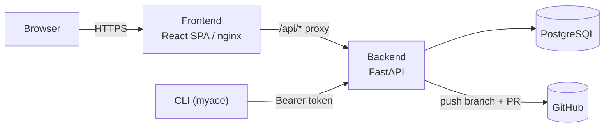
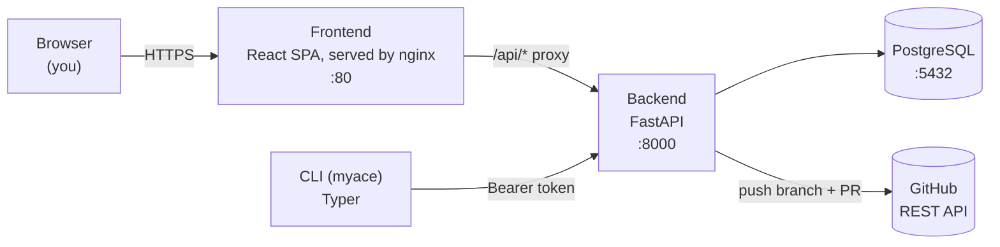

# MyACE — My Agentic Coding Environment

[](https://github.com/niels-emmer/myace/actions/workflows/ci.yml)
[](https://github.com/niels-emmer/myace/releases)
[](LICENSE)
[](backend/pyproject.toml)
[](frontend/package.json)

## What it is

**MyACE makes your AI coding agent's rules, skills, and workflows portable.**
Write them once, keep them in one place, and compile them into whatever
format Claude Code, OpenCode, Cursor (and whatever comes next) actually
expects — instead of hand-maintaining N slightly-different copies, or
picking one tool and losing the rest.

> **MyACE is under heavy development and changes near daily. Use at your own
> risk.** Currently supporting **11 coding environments**, with a community
> store holding **15 starter agent profiles** (3 base + 12 specializations).

<table>
  <tr>
    <td width="50%"></td>
    <td width="50%"></td>
  </tr>
  <tr>
    <td width="50%"></td>
    <td width="50%"></td>
  </tr>
</table>

## How it works

If you've built up a set of coding conventions, review rubrics, or agent
personas you like, you've probably hit this: every framework wants them in
a different shape. OpenCode wants Markdown skill/agent/command files under
`.opencode/` plus an `AGENTS.md` and a JSON `opencode.json` for models/MCP.
Claude Code wants `CLAUDE.md` plus `.claude/agents/*.md`. Cursor wants
`.cursorrules` and `.mdc` files. None of that structure is really about the
*content* — it's packaging.

MyACE stores the content once, as Markdown with YAML frontmatter (the
**Canonical IR**), and translates it into each framework's native layout on
demand — from a web UI, or with a one-line CLI pull:

```yaml
---
type: rule | skill | agent | workflow | model_config
name: my-rule
version: 1.0.0
target_compatibility: [opencode, claude-code, cursor]
priority: 50
tags: [python, type-safety]
description: Enforces strict type annotations
---
# Rule Content

Markdown body — the actual instruction content.
```



A FastAPI backend owns the data and does all the real work; the React
frontend and the CLI are both thin clients of the same API. See
[docs/architecture.md](docs/architecture.md) for the full picture, including
the compilation pipeline, the Canonical IR's exact schema, and the auth
model.

## Features

- **Import from anywhere** — scan a local config directory (`~/.claude`,
  `~/.config/opencode`, `~/.cursor`) or a GitHub repo, pick exactly which
  rules/skills/agents to bring in, and they become a portable **Collection**.
- **Compose, don't copy** — a **Profile** combines a base collection with
  additional ones, layered by priority, with individual items toggled on or
  off — a named recipe you compile per target, not a duplicated file tree.
- **Compile to any supported framework** — one click (or `myace pull`) turns
  a profile into the exact files Claude Code, OpenCode, or Cursor expect.
  See [Architecture](#architecture) below for the full list of 11 supported
  frameworks.
- **Community collections** — publish your collections to make them public
  immediately, browse and import collections published by other users. This
  is self-serve, not admin-moderated.
- **Starter packs out of the box** — every fresh install seeds itself with 3
  base collections (Vibecoder, Software Engineer, Data Scientist) and 12
  specializations (Frontend, Backend, Infrastructure as Code Expert, Security
  Auditor, Documentation Editor, Full-Stack Developer, DevOps/Platform
  Engineer, Java/Spring Developer, iOS Developer, Android Developer,
  Spec-Driven Development, AI/LLM Engineering), so there's real, opinionated
  content to build a first profile from on day one.
  This is a fixed, code-reviewed set maintained in
  [`collections/`](collections/) — separate from user-published community
  collections, and not affected by them.
- **A real CLI** — `myace login`, `myace pull`, `myace import --push`. Script
  it, put it in a dotfiles repo, run it on a fresh machine. See
  [docs/cli.md](docs/cli.md) for the full command reference.
- **Real multi-user auth** — email+password (with email-based password
  reset) or OIDC/GitHub/Google SSO, private-by-default collections and
  profiles with an explicit public/private flag, and an admin role for
  oversight. Not a toy single-user hack. See
  [docs/invariants.md#authorization](docs/invariants.md#authorization) for
  the exact rules.
- **Admin controls in the UI, no redeploy needed** — configure SMTP and
  OAuth provider credentials (Client ID/Secret, redirect URLs, a
  connectivity test button) from System Settings instead of editing `.env`;
  enable/disable target adapters and other users' accounts system-wide.
- **Responsive** — the web UI works on a phone-width screen (a slide-out
  drawer replaces the sidebar below ~1024px), not just desktop.

## Getting Started

### Prerequisites

- Docker & Docker Compose
- Python 3.12+ (for the CLI)
- Node.js 20+ (for frontend development)

### Quick Start

```bash
git clone https://github.com/niels-emmer/myace.git
cd myace

# 1. Configure environment
cp .env.example .env

# 2. Start the dev stack (hot reload, direct ports, home dir mounted for import)
docker compose -f docker-compose.yml -f docker-compose.dev.yml up -d --build

# 3. Run database migrations
docker compose exec backend alembic upgrade head

# 4. Access
#    Web UI:       http://localhost:80
#    API (direct): http://localhost:8000
#    API Docs:     http://localhost:8000/docs

# For Vite HMR during frontend development:
cd frontend && npm run dev   # starts on :5173, proxies /api to :8000
```

The first person to register an account automatically becomes an admin, as
long as `ADMIN_BOOTSTRAP_ENABLED` is still `true` (the default). If you're
planning to expose this beyond localhost, do that registration and then
turn `ADMIN_BOOTSTRAP_ENABLED` off before anyone else can — see
[docs/deployment.md](docs/deployment.md#fork-it-and-make-it-yours).

### Installing the CLI

The CLI ships as a standalone binary (no Python required) or via `pip`.
Full install instructions, the command reference, and the `myace import` /
`myace serve` workflows are in [docs/cli.md](docs/cli.md). The short version:

```bash
myace login --server <your-server-url> --token <your-api-token>
myace --help
```

Create an API token from the web UI's Settings page.

### Deploying it for real

Running it in production (single machine or behind a reverse proxy),
hardening a fresh fork, and configuring SSO/SMTP are all covered in
[docs/deployment.md](docs/deployment.md). Database backups are covered in
[docs/backups.md](docs/backups.md).

## Architecture



- **`backend/`** — FastAPI + SQLModel API. Owns the database, the canonical
  IR, authentication, and the compilation pipeline (Postgres in prod, SQLite
  for tests).
- **`frontend/`** — React + Vite + TailwindCSS SPA, served by nginx in
  production, proxying `/api/*` to the backend.
- **`cli/`** — Python Typer CLI (`myace`) that pulls compiled profiles from
  the server and can scan local config directories to import them.

None of the three talk to Postgres directly except the backend — the
frontend and CLI only ever see the HTTP API. Two roles exist: **user**
(full access to their own data, read-only on anything another user marked
public) and **admin** (bypasses ownership, for oversight). See
[docs/architecture.md](docs/architecture.md) for the full components
breakdown, the compilation pipeline, and the auth model, and
[docs/data-model.md](docs/data-model.md) for the database schema.

### Target adapters

| Adapter | Target Frameworks | Output |
|---------|------------------|--------|
| Claude Code | `claude-code`, `claude` | `CLAUDE.md`, `.claude/agents/*.md`, `.claude/skills/*/SKILL.md`, `.claude/commands/*.md` |
| OpenCode | `opencode`, `open-code` | `.opencode/skills/*/SKILL.md`, `.opencode/agents/*.md`, `.opencode/commands/*.md`, `AGENTS.md`, `opencode.json` |
| Cursor | `cursor`, `cursor-editor` | `.cursor/rules/*.mdc` |
| Codex CLI | `codex-cli`, `codex`, `openai-codex` | `AGENTS.md`, `.agents/skills/*/SKILL.md`, `.codex/agents/*.toml`, `.codex/config.toml` |
| GitHub Copilot CLI | `copilot-cli`, `copilot`, `github-copilot` | `.github/copilot-instructions.md`, `.github/instructions/*.instructions.md` |
| Cline | `cline`, `clinerules` | `.clinerules/*.md` |
| Windsurf | `windsurf`, `codeium-windsurf` | `.windsurf/rules/*.md` |
| Aider | `aider` | `CONVENTIONS.md`, `.aider.conf.yml` |
| Continue | `continue`, `continue-dev` | `.continue/rules/*.md`, `.continue/prompts/*.md`, `config.yaml` |
| Goose | `goose` | `AGENTS.md` |
| Amazon Q Developer | `amazon-q`, `amazonq` | `.amazonq/rules/*.md` |

The table above shows output *paths* only. For each adapter's actual
frontmatter fields/config schema — and doc citations for every field — see
[docs/adapters-research.md](docs/adapters-research.md), which every adapter
was re-verified against as of Aug 2026. An admin can disable any adapter
system-wide from System Settings → Adapter Registry.

## Project Structure

```
├── AGENTS.md                    # AI agent maintenance guidelines
├── CLAUDE.md                    # Claude Code-specific agent guidance
├── CONTRIBUTING.md, SECURITY.md, CODE_OF_CONDUCT.md, LICENSE
├── docs/                        # Deep-dive documentation (humans + agents)
├── collections/                 # Starter-pack content (seeded on boot),
│   ├── base/                    #   hand-curated and code-reviewed here —
│   └── additional/              #   see "Starter packs" section in AGENTS.md
├── docker-compose.yml           # Single-machine production
├── docker-compose.dev.yml       # Dev overrides (ports, mounts, CORS)
├── docker-compose.prod.yml      # VPS overrides (external network, no ports)
├── .env.example
│
├── backend/                     # FastAPI + SQLModel
│   ├── Dockerfile
│   ├── pyproject.toml
│   ├── alembic.ini
│   ├── alembic/                 # Migrations
│   ├── app/
│   │   ├── main.py              # App entrypoint, CORS + session middleware
│   │   ├── core/                # Config, DB session, OIDC/security, crypto (encrypted admin secrets), deps (auth), authz (ownership checks)
│   │   ├── models/               # SQLModel schemas (User, Collection, Artifact, Profile, ApiToken, DocCache, SystemSettings)
│   │   ├── api/                  # Routes: auth, collections, profiles, adapters, doc_cache, admin
│   │   ├── adapters/             # Canonical IR → target translators (11: Claude Code, OpenCode, Cursor, Codex CLI, Copilot CLI, Cline, Windsurf, Aider, Continue, Goose, Amazon Q)
│   │   └── services/             # Compiler, doc verifier, scanner (local + git), github_export, seed_collections,
│   │                              #   email (SMTP send), effective_settings (DB-override-vs-env resolver)
│   └── tests/                    # pytest suite
│
├── frontend/                    # React + Vite + TailwindCSS
│   ├── Dockerfile
│   ├── nginx.conf
│   ├── package.json
│   ├── src/
│   │   ├── components/           # Layout (responsive sidebar/drawer), shared UI
│   │   ├── contexts/              # AuthContext (current user/session), ThemeContext (light/dark/system)
│   │   ├── pages/                 # Login, ResetPassword, Dashboard, Collections, CollectionDetail,
│   │   │                          #   CommunityCollections, CommunityCollectionDetail, Profiles, ProfileDetail,
│   │   │                          #   Import, Compile, UserSettings, SystemSettings (admin-gated)
│   │   ├── lib/                   # API client
│   │   └── types/                 # TypeScript interfaces
│   └── dist/                     # Production build
│
├── cli/                          # Python Typer CLI
│   ├── pyproject.toml
│   └── myace_cli/
│       ├── main.py               # Entrypoint (7 commands)
│       ├── auth.py               # Credential storage
│       ├── sync.py               # Profile fetch + write
│       ├── scanner.py            # Local directory scanner
│       └── adapters/             # Client-side translation fallbacks
│
└── .github/                      # Issue/PR templates, CI workflow, Dependabot config
```

### Documentation map

| Document | What it covers |
|---|---|
| [`docs/architecture.md`](docs/architecture.md) | Components, compilation pipeline, canonical IR, auth model |
| [`docs/data-model.md`](docs/data-model.md) | Every table, its columns, and how they relate |
| [`docs/invariants.md`](docs/invariants.md) | Rules the system must never violate, and where they're enforced |
| [`docs/extending.md`](docs/extending.md) | How to add an adapter, artifact type, SSO provider, or route |
| [`docs/deployment.md`](docs/deployment.md) | Forking, hardening, and running in production (single machine or behind a reverse proxy) |
| [`docs/cli.md`](docs/cli.md) | Installing and using `myace`: commands, `import`, the local companion server |
| [`docs/backups.md`](docs/backups.md) | Database backup retention, offsite copy, and restore procedure |
| [`docs/debugging.md`](docs/debugging.md) | Known gotchas — symptom, cause, fix |
| [`docs/adapters-research.md`](docs/adapters-research.md) | Every adapter's confirmed file format, doc citations, and unbuilt candidates |
| [`docs/adr/`](docs/adr/) | Architecture Decision Records — why the non-obvious choices were made |
| [`AGENTS.md`](AGENTS.md) / `CLAUDE.md` | Rules and conventions for AI coding agents working in this repo |

`docs/` is written for both humans and AI coding agents — start there for
anything deeper than "how do I run this."

## Roadmap

MyACE doesn't yet cover every AI coding tool, and a couple of pieces of the
existing pipeline are known to be incomplete:

- **More adapters** — pi.dev, Zed AI, and CodeGPT are viable, unbuilt
  candidates; Windsurf's adapter still targets its legacy path rather than
  the Devin Desktop rebrand, and Amazon Q Developer could emit its newer
  native agent format. Full detail (plus what's already been evaluated and
  rejected — Roo Code, Sourcegraph Cody) is in
  [docs/adapters-research.md#future-plans](docs/adapters-research.md#future-plans).
- **`myace pull` has no offline fallback** — three adapters are mirrored
  client-side in `cli/myace_cli/adapters/`, but `myace pull` doesn't call
  into them yet, so it always needs a reachable server today. See
  [docs/architecture.md#adapters](docs/architecture.md#adapters).

If you use a framework not listed above, or want to pick up an open item,
see [Contributing](#contributing-and-forking) below — an issue or PR is
the way to propose it.

## Contributing and Forking

Bug reports, feature requests, and PRs are welcome — see
[`CONTRIBUTING.md`](CONTRIBUTING.md) for the development setup, conventions,
and PR process. Please read [`CODE_OF_CONDUCT.md`](CODE_OF_CONDUCT.md) too.

Found a security issue? Please don't open a public issue — see
[`SECURITY.md`](SECURITY.md) for how to report it privately.

MyACE is equally designed to be **forked and self-hosted**, not run as
someone else's SaaS — see [docs/deployment.md](docs/deployment.md) for the
checklist to work through before exposing a fork beyond localhost.

A few things worth knowing as either a contributor or an operator running
their own fork:

- **Schema changes** ship as Alembic migrations
  (`docker compose exec backend alembic upgrade head` to apply). Every
  migration has a working `downgrade()` — see
  [`AGENTS.md`](AGENTS.md#2-database-migration-rules).
- **CI** ([`.github/workflows/ci.yml`](.github/workflows/ci.yml)) runs
  lint, type-check, and tests for the backend, CLI, and frontend on every
  PR, plus a Docker build check.
- **Dependabot** ([`.github/dependabot.yml`](.github/dependabot.yml)) opens
  weekly PRs for backend/CLI (pip), frontend (npm), Docker base images, and
  GitHub Actions themselves, grouping minor/patch bumps but leaving each
  major-version bump as its own PR (see
  [docs/debugging.md](docs/debugging.md) for why that split matters).
- **Documentation moves in the same PR as the code it describes** — see
  [`AGENTS.md`](AGENTS.md#14-documentation-maintenance).

## License

[MIT](LICENSE) © 2026 [Niels Emmer](https://github.com/niels-emmer)

## Acknowledgements

MyACE is built on [FastAPI](https://fastapi.tiangolo.com/),
[SQLModel](https://sqlmodel.tiangolo.com/), [Alembic](https://alembic.sqlalchemy.org/),
[Authlib](https://authlib.org/), [React](https://react.dev/),
[Vite](https://vitejs.dev/), [TanStack Query](https://tanstack.com/query),
[Tailwind CSS](https://tailwindcss.com/), and [Typer](https://typer.tiangolo.com/).
Thanks to the maintainers of all of them.

Some starter-pack collection content draws on patterns and principles from
the wider open-source agentic-coding community, credited here rather than
copied verbatim into the artifacts themselves:

- The `spec-driven-dev` collection adapts the spec → clarify → plan → tasks
  → analyze → implement workflow popularized by GitHub's
  [spec-kit](https://github.com/github/spec-kit) (MIT).
- The `ai-engineering` collection's `agent-design-principles` skill is
  grounded in [12-factor-agents](https://github.com/humanlayer/12-factor-agents)
  (HumanLayer, Apache-2.0).
- Gap analysis for both collections cross-referenced
  [wshobson/agents](https://github.com/wshobson/agents) (MIT) and
  [VoltAgent/awesome-claude-code-subagents](https://github.com/VoltAgent/awesome-claude-code-subagents)
  (MIT) against this repo's existing agent/skill lineup.

Logo: <a href="https://www.flaticon.com/free-icons/layers" title="layers icons">Layers icons created by Good Ware - Flaticon</a>.

This entire project — every line of code, every test, every doc, every
infrastructure config — was written by AI coding agents:
[Claude Code / Sonnet 5](https://docs.anthropic.com/en/docs/claude-code/overview)
and [OpenCode / DeepSeek V4-Flash](https://github.com/niels-emmer/opencode).
The human (Niels) reviewed, directed, and shipped it.
