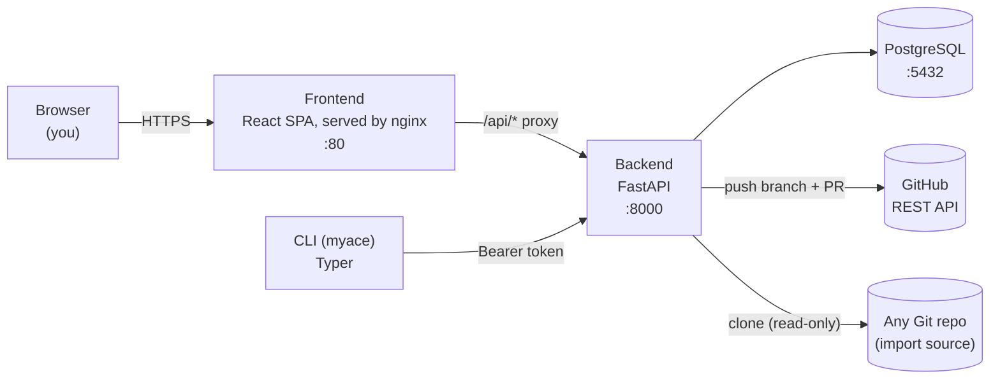

# Architecture

## The problem MyACE solves

Every AI coding tool (Claude Code, OpenCode, Cursor, ...) wants its rules,
skills, agent definitions, and workflows in a slightly different file layout
and format. If you maintain a set of conventions you like, you either
maintain N copies by hand or pick one tool and lose portability.

MyACE's answer: store everything once, in a **Canonical Intermediate
Representation (IR)**, and translate that IR into whatever a given framework
expects, on demand.

## Components



- **`backend/`** — FastAPI + SQLModel. Owns the database, the canonical IR,
  authentication, and the compilation/translation pipeline. Everything of
  substance happens here; the frontend and CLI are both thin clients of the
  same API.
- **`frontend/`** — React + Vite + TailwindCSS SPA, served by nginx in
  production. Talks to the backend exclusively through `/api/v1/*`, proxied
  to the same origin in both dev (Vite proxy) and prod (nginx) — this is
  deliberate, see [ADR-0002](adr/0002-session-cookie-auth.md).
- **`cli/`** — Python Typer CLI. Pulls compiled profiles down to a local
  directory (`myace pull`) and can push a local config directory up as a new
  collection (`myace import --push`). Authenticates with a long-lived Bearer
  API token, not a browser session.

None of the three talk to Postgres directly except the backend — the
frontend and CLI only ever see the HTTP API.

## Canonical IR

Every artifact — a rule, skill, agent, workflow, or model_config — is
Markdown with YAML frontmatter:

```yaml
---
type: rule | skill | agent | workflow | model_config
name: my-rule
version: 1.0.0
target_compatibility: [opencode, claude-code, cursor]
priority: 50
tags: [python, type-safety]
description: Enforces strict type annotations
---
# Rule Content

Markdown body — the actual instruction content.
```

In the database, this is denormalized onto the `Artifact` table
(`backend/app/models/artifact.py`): most fields map 1:1 to columns, but
`tags` and `target_compatibility` are stored as JSON-encoded `Text` (see the
[serialization gotcha](debugging.md#response_model-silently-strips-fields-you-didnt-declare)
if you're touching artifact response code). `CanonicalArtifact` is the
in-memory Pydantic representation used during compilation — deliberately
decoupled from the SQLModel table so the compiler doesn't need a DB session
to reason about artifacts. See [data-model.md](data-model.md) for the full
schema.

## Collections, Profiles, and why both exist

- **Collection** = a bag of artifacts from one source: a GitHub import, a
  local machine scan, or artifacts copied in via bulk-export. This is where
  artifacts *live*.
- **Profile** = a named composition: one base collection plus optional
  additional collections, layered by priority, with specific artifacts
  disabled. This is what you actually *compile* — "give me the OpenCode
  files for my base Python rules plus my personal additions, minus the two
  skills I don't want here."

Think packages vs. a lockfile: collections are where the building blocks
live; a profile is a specific, named recipe assembled from them, compiled
for one target framework at a time.

## Compilation pipeline

`compile_profile()` in `backend/app/services/compiler.py`:

1. Resolve the base collection + every additional collection referenced by
   the profile.
2. Pull enabled artifacts from each (skipping anything in the profile's
   `disabled_artifact_ids`).
3. Deduplicate by artifact `name` — later collections in the list override
   earlier ones. This is the only "merge" semantics that exist; there's no
   field-level merging of two artifacts with the same name.
4. Sort by `priority` descending.
5. Hand the list to a target adapter's `translate()`.

## Adapters

`backend/app/adapters/` (and a client-side fallback copy in
`cli/myace_cli/adapters/`) each implement:

```python
class BaseAdapter(ABC):
    def adapter_name(self) -> str: ...
    def supported_targets(self) -> list[str]: ...
    def translate(self, artifacts: list[CanonicalArtifact]) -> dict[str, str]: ...  # {filename: content}
```

Adapters are stateless — all the interesting logic (resolution, merging,
priority) happens before `translate()` is called; the adapter's only job is
"canonical artifacts in, framework-specific files out." Twelve are
registered today (`backend/app/adapters/__init__.py`): `claude_code`,
`opencode`, `cursor`, `codex_cli`, `copilot_cli`, `cline`, `windsurf`,
`aider`, `continue_dev`, `goose`, `cody`, `amazon_q`. The CLI's
offline fallback (`cli/myace_cli/adapters/`) still only mirrors the
original three. See
[extending.md#adding-a-target-adapter](extending.md#adding-a-target-adapter)
to add another.

## Import and export are symmetric, on purpose

**Import** (`backend/app/services/scanner.py`, mirrored in
`cli/myace_cli/scanner.py`): reads a directory (local, or a shallow git
clone) and recognizes `skills/<name>/SKILL.md`, `agents/*.md`,
`commands/*.md`, `AGENTS.md` (`##` sections become rules), and
`opencode.json` (models + MCP servers become `model_config` artifacts).

**Export** (`backend/app/services/github_export.py`): does the reverse —
converts a collection's canonical artifacts back into that same directory
layout, then pushes it to a new branch on GitHub and opens a PR, via the
GitHub REST API directly (blobs → tree → commit → branch ref → PR; no local
`git` clone or push). See [ADR-0004](adr/0004-github-export-via-rest-api.md)
for why.

The two are kept deliberately symmetric: a collection exported to GitHub and
re-imported from that same repo should scan back to the same artifacts.

## Authentication & Authorization

Every API route requires an authenticated user. Two mechanisms feed one
dependency:

- **Session cookie** — set after `/auth/login` (email+password) or an
  OIDC/GitHub/Google callback. This is what the web UI uses.
- **Bearer API token** — bcrypt-hashed, long-lived, created via
  `POST /auth/tokens`. This is what the CLI uses.

`get_current_user` (`backend/app/core/deps.py`) accepts either and resolves
to the same `User` row — routes don't need to know which path was used. See
[ADR-0002](adr/0002-session-cookie-auth.md) for why cookies (not
JWT-in-localStorage) were chosen for the web session.

Authorization is ownership + visibility, not per-route roles:

- Every `Collection`/`Profile` has an `owner_id` and a public/private flag
  (`visibility` / `is_public`).
- `authorize_access()` and `owner_or_public_clause()`
  (`backend/app/core/authz.py`) are the only two primitives every protected
  route uses. `current_user.is_admin` bypasses both, for oversight.
- `Artifact` has no owner of its own — access is authorized against its
  parent `Collection`.

See [invariants.md](invariants.md#authorization) for the exact rules and
[ADR-0003](adr/0003-ownership-based-authorization.md) for why this model
(and not RBAC/teams) was chosen.

## Deployment shapes

Three Compose files layer on top of each other:

| File | Purpose |
|---|---|
| `docker-compose.yml` | Base — single-machine prod on `:80` |
| `+ docker-compose.dev.yml` | Dev — adds `:8000` for direct backend access, mounts `~/` to `/host-home/` (so the scanner can reach host config dirs), CORS for Vite |
| `+ docker-compose.prod.yml` | VPS behind a reverse proxy — no host ports, attaches an external Docker network via `PROXY_NETWORK` |

See the [README's Quick Start](../README.md#quick-start) for the exact
commands.
