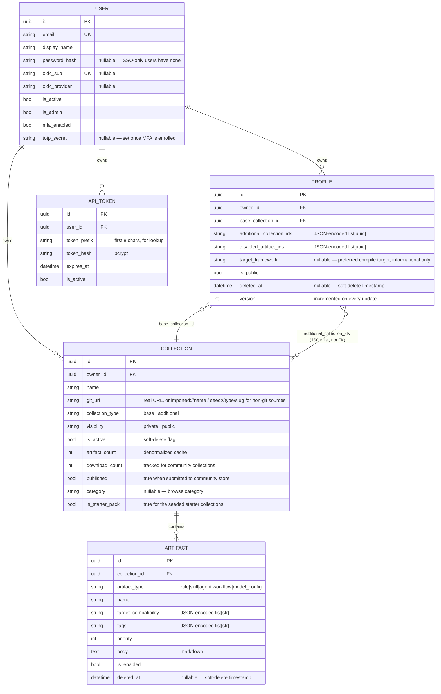

# Data Model

All tables use UUID primary keys (never auto-increment integers — see
[invariants.md](invariants.md)). Timestamps are timezone-aware
(`DateTime(timezone=True)`), stored in UTC.

## Entity relationships

`DOC_CACHE` (framework documentation cache for adapter compatibility rules)
has no relationships to the rest of the schema — it's a standalone TTL cache,
keyed by `framework` + `content_hash`.

`SYSTEM_SETTINGS` also has no relationships — it's a singleton row
(`id` always `1`) holding global, admin-editable config: which auth
providers are enabled, whether registration/MFA are allowed or forced, and
the doc cache TTL. See the `system_settings` section below.

## Tables

### `users`

The only table every other owned table has a foreign key into. A user can
authenticate via password (`password_hash`, nullable — SSO-only accounts
never set one), OIDC/GitHub/Google (`oidc_sub` + `oidc_provider`, unique
together), or both. `is_admin` bypasses ownership checks everywhere; see
[invariants.md](invariants.md#authorization). `mfa_enabled` + `totp_secret`
back TOTP-based MFA (`pyotp`) — `totp_secret` is only set once enrollment
completes via `POST /auth/me/mfa/totp/setup` + `.../verify`. `reset_token_hash`
+ `reset_token_expires_at` back password-reset-by-email (`POST
/auth/forgot-password` / `/auth/reset-password`) — only the SHA-256 hash of
the emailed token is stored, mirroring the API-token-hash pattern; the token
is single-use (both fields are cleared on a successful reset) and expires
after 1 hour.

### `collections`

A named bag of artifacts. `git_url` is a real repository URL for
GitHub-imported collections, or a synthetic URI for anything that didn't
come from a real git remote — `imported://<name>` for a local scan or
bulk-exported artifacts, `imported://community/<name>` for a community
import, `seed://<collection_type>/<slug>` for the built-in starter packs
(`seed_collections.py`) — don't assume it's always dereferenceable.
`visibility` (`private`/`public`) is the only access-control dimension
beyond ownership; there is no per-collaborator sharing. `is_active` is a
soft-delete flag — deleted collections are never physically removed.
`artifact_count` is a denormalized cache updated by every route that
adds/removes artifacts (import, bulk delete, bulk export) — if you add a new
artifact-mutating route, update it there too or the count will drift.
`is_starter_pack` marks the collections seeded on every backend startup from
`collections/base/` and `collections/additional/`, owned by a dedicated
passwordless system account — see the "Starter packs" section in
`CLAUDE.md`.

### `artifacts`

Belongs to exactly one collection (`collection_id`, `ON DELETE` not
configured — see [invariants.md](invariants.md#data-integrity) for what
that means in practice). Has **no `owner_id` of its own** — authorization is
always done via the parent collection. `target_compatibility` and `tags` are
JSON-encoded into `Text` columns rather than being normalized into their own
tables; every route that returns artifacts must decode them before
responding (see
[debugging.md](debugging.md#response_model-silently-strips-fields-you-didnt-declare)).
`is_enabled` is per-artifact and independent of the collection's
`is_active` — a disabled artifact is skipped during compilation unless a
profile explicitly asks to `include_disabled`. `deleted_at` supports
soft-delete — artifacts are never physically removed from the database.

### `profiles`

`base_collection_id` is a real foreign key; `additional_collection_ids` and
`disabled_artifact_ids` are **not** — they're JSON-encoded UUID lists,
resolved and validated at request time rather than enforced by the database.
This means the database will happily store a profile referencing a
collection that's since been deleted or made private; the compiler
(`compile_profile()`) silently skips any collection ID it can't resolve
rather than erroring. `version` increments on every `PUT` — there's no
history table, just the counter. `target_framework` is an optional,
free-string "preferred target" hint shown in the UI — it's never validated
against the adapter registry and has no effect on compilation; the actual
target is chosen per-compile-request. `is_public` is the profile's own
visibility flag, independent of the visibility of the collections it
references (see the documented gap in
[invariants.md](invariants.md#a-gap-thats-accepted-not-fixed)). `deleted_at`
supports soft-delete — profiles are never physically removed from the
database.

### `api_tokens`

CLI authentication. The raw key is generated once, split into an 8-char
`token_prefix` (stored in plaintext, used to narrow the lookup) and the full
key (bcrypt-hashed into `token_hash`). The raw key is returned to the caller
exactly once, at creation — the database never stores it in recoverable
form. `expires_at` is enforced in `get_current_user`; there's no background
job that revokes expired tokens, they just stop authenticating.

### `doc_cache`

Unrelated to the auth/ownership model above — a TTL-based cache of fetched
framework documentation, used by adapter compatibility checks. Not
owner-scoped; it's shared, read-only reference data. `deleted_at` supports
soft-delete — cache entries are never physically removed from the database.

### `system_settings`

A singleton row (`id` is always `1`, enforced by convention rather than a
DB constraint) holding global, admin-only config: which auth providers
(`oidc_enabled`/`github_enabled`/`google_enabled`) and registration
(`allow_registration`) are turned on, whether MFA is available
(`mfa_enabled`) or mandatory (`mfa_forced`), and `doc_cache_ttl_days`. Read
via `GET /admin/settings`, written via `PATCH /admin/settings`
(`SystemSettings.tsx`) — both admin-gated. Not owner-scoped; there is
exactly one row.

Also holds the SMTP config used for password-reset emails: `smtp_enabled`,
`smtp_host`, `smtp_port`, `smtp_username`, `smtp_from_email`,
`smtp_from_name`, `smtp_use_tls`, and `smtp_password_encrypted` (the
admin-entered password, Fernet-encrypted — see
[ADR-0006](adr/0006-encrypted-admin-editable-secrets.md)). Any of these left
unset falls back to the matching `SMTP_*` env var at runtime
(`app/services/effective_settings.py`); a non-empty DB value always wins.
`SystemSettingsRead` never returns `smtp_password_encrypted` itself — only a
computed `smtp_password_set: bool` — and `SystemSettingsUpdate` accepts a
plaintext, write-only `smtp_password` field that the `PATCH /admin/settings`
handler encrypts before persisting.

Also holds per-provider OAuth credentials — `oidc_client_id`,
`oidc_client_secret_encrypted`, `oidc_issuer_url`, `oidc_scopes`,
`github_client_id`, `github_client_secret_encrypted`, `google_client_id`,
`google_client_secret_encrypted` — entered via System Settings' expandable
Authentication Providers rows instead of only `.env`. Same precedence and
encryption contract as SMTP above (`get_effective_oauth_config()` in
`effective_settings.py`; `{provider}_client_secret_set` computed booleans,
never the encrypted value, on `SystemSettingsRead`). `security.py`'s
`get_oauth_client()` rebuilds a provider's Authlib client whenever its
effective config changes (tracked by a fingerprint), so a credential saved
here takes effect on the next login/callback request without a restart.

Also holds `disabled_adapters` — a JSON-encoded `list[str]` of adapter
names (`BaseAdapter.adapter_name()`) an admin has disabled system-wide,
same manual-JSON-in-`Text`-column convention as
`Profile.disabled_artifact_ids`. Toggled via `PATCH
/admin/adapters/{name}?enabled=<bool>`. Enforced in two places: the
frontend's compile target picker (`TargetExporter.tsx`) filters disabled
adapters out of the dropdown, and `compile_profile()`
(`app/services/compiler.py`) — the single choke point both
`/profiles/compile` and `/profiles/compile/zip` funnel through — raises
`AdapterDisabledError` (→ HTTP 400) if the requested `target` is disabled,
so the restriction can't be bypassed by calling the API directly.

## Why JSON-as-text instead of proper junction tables

`Collection.tags`/`target_compatibility` and `Profile.additional_collection_ids`/`disabled_artifact_ids`
could be normalized into join tables. They're JSON-in-text instead because:

- These lists are always read/written as a whole (never queried
  element-wise — nothing does "find all artifacts tagged X" at the SQL
  level today).
- It keeps the schema small for what is, so far, a single-user-per-resource
  data model with no need for relational queries across these lists.

## Community collections

Published collections have `published = True` and a `category` string for
browsing. `download_count` tracks how many times the collection has been
imported. When a user publishes a collection, it is exported to the MyACE
repository's `collections/` folder via the GitHub API, and a pull request
is opened for admin review. The database row is marked as published
immediately on a successful API response.

Importing a community collection creates a new user-owned `Collection` with
copied `Artifact` rows and increments `download_count` on the source.

If a future feature needs to query inside these lists (e.g. "find all public
collections tagged `python`"), that's the point to normalize — don't
work around it with `LIKE '%...%'` queries on the JSON text.
